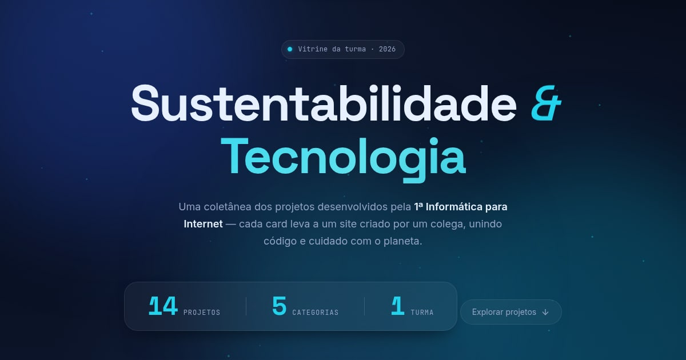

# Sustentabilidade & Tecnologia

Vitrine dos projetos de sustentabilidade e tecnologia desenvolvidos pela turma da
**1ª Informática para Internet**. Cada card leva ao site criado por um colega.



## Sobre

O site reúne **14 projetos** organizados em **5 categorias**:

| Categoria | Tema |
|---|---|
| Reciclagem Inteligente & Logística Reversa | Gestão de resíduos, descarte consciente, coleta seletiva |
| Conservação Hídrica & Vida Marinha | Preservação dos oceanos e uso consciente da água |
| Cidades Inteligentes & Urbanismo Sustentável | Energia limpa, mobilidade e eficiência urbana |
| Tecnologia Sustentável & Inovação Ecológica | IA, robótica e gadgets a serviço do meio ambiente |
| Agricultura Sustentável & AgroTech | Irrigação inteligente e cultivo de baixo impacto |

## Recursos

- **Busca em tempo real** por nome, descrição ou categoria (atalho: tecle `/`)
- **Favoritos** salvos no navegador, com filtro rápido
- **Marcação de visitados** nos projetos que você já abriu
- **Tema claro/escuro**, seguindo a preferência do sistema na primeira visita
- **Acessível por teclado**: cards abrem com `Enter`, modal com foco controlado e `Esc` para fechar
- **Responsivo** de 320px a telas ultrawide
- Animações que respeitam `prefers-reduced-motion`

## Como rodar localmente

Não há build nem dependências. Basta servir a pasta:

```bash
python3 -m http.server 8000
# abra http://localhost:8000
```

Abrir o `index.html` direto pelo navegador também funciona.

## Como adicionar um projeto novo

Toda a configuração fica no topo do `script.js`, no array `SITES`.
Adicione um objeto dentro da categoria certa:

```js
{
  id: "meu-projeto",              // identificador único (usado nos favoritos)
  nome: "Meu Projeto",
  descricao: "O que o site faz, em uma frase.",
  categoria: "reciclagem",        // reciclagem | agua | cidades | tecnologia | agro
  link: "https://exemplo.github.io/meu-projeto/",
  imagem: "imagens/meu-projeto.webp",  // ou null para usar o ícone da categoria
},
```

Nada mais precisa mudar: as seções, os contadores do topo e a busca se
atualizam sozinhos a partir desse array.

### Sobre as capas

As imagens em `imagens/` são capturas da tela inicial de cada site, recortadas
em 16:10 e convertidas para WebP (14–35 KB cada). Se a capa de um projeto não
carregar, o card cai automaticamente para o ícone da categoria.

## Estrutura

```
index.html    — marcação da página
style.css     — estilos, temas e animações
script.js     — dados dos projetos + toda a lógica
imagens/      — capas dos projetos e imagem de compartilhamento
```

## Tecnologias

HTML, CSS e JavaScript puros — sem frameworks nem etapa de build.
Ícones via [Lucide](https://lucide.dev) e fontes do Google Fonts
(Space Grotesk, Inter e JetBrains Mono).

## Publicação

O site é estático e está preparado para o GitHub Pages. Se publicar em outro
endereço, atualize a URL base nas tags `og:` e `canonical` do `index.html`
para que a prévia de compartilhamento continue funcionando.

---

Desenvolvido por **Leonardo de Campos Silva Machado** — 1ª Informática para Internet · 2026
